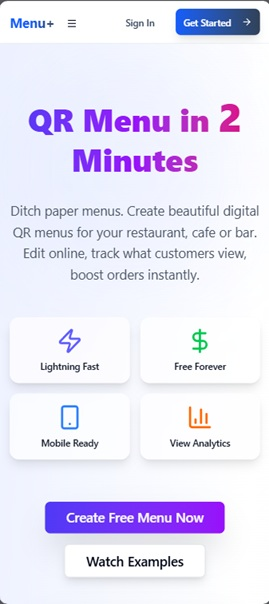
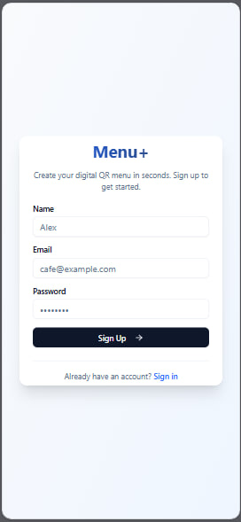
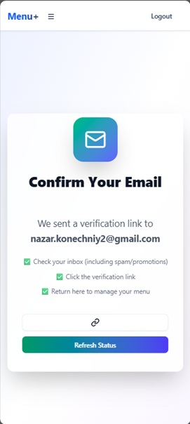
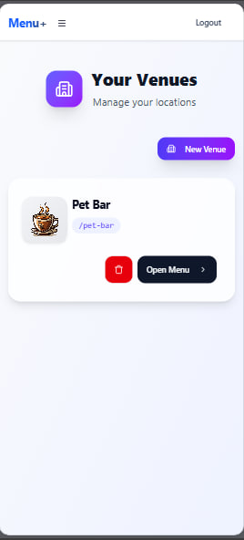
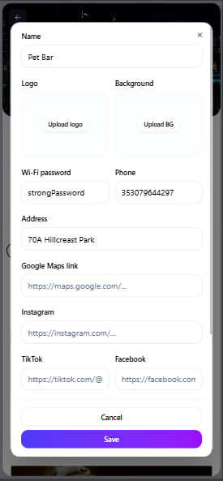
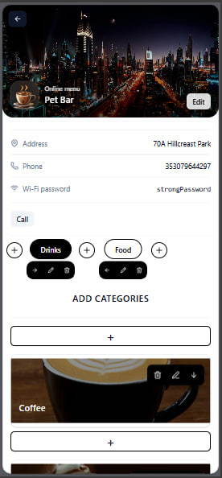

# Menu+ 🚀


**Digital QR menus for small cafes, bars & food trucks** — replace torn paper menus with scannable QR codes. Edit prices in 10 seconds, no designers needed.


## 🎯 The Problem It Solves

| ❌ Paper Menus | ✅ Menu+ |
|---|---|
| Tear & get dirty | 1 QR code per table |
| Reprint 20 sheets for 1 price change | Edit in 10 sec admin |
| Waiter explains 5 min | Guest scrolls phone |
| Hygiene issues | Contactless 2026-ready |

**Target:** Small venues (5-20 tables), food trucks, coffee shops tired of reprints.

## 🔥 How It Works

**Friday night bar scenario:**
```
TABLE #7 [QR] → Scans to:
🍺 Heineken 12€
🍔 Classic Burger 6€ 
🍟 Fries 2€
🍹 Mojito 13€
👉 [Order in WhatsApp]
```

**Workflow:**
1. Owner registers → "My Bar"
2. Add dishes + photos → "Beer 12€" 
3. Generate 10 QR stickers (Table 1-10) or just 1 universal QR
4. Print & stick → Done!

## ✨ Key Features
- **Fast** (5 min menu setup)
- **Free**
- **Beautiful**
- **Smart** (guest analytics)
- QR generation
- WhatsApp order button
- PWA

## 📱 Screenshots

### 1. Landing Page


QR Menu in 2 minutes — entry point for cafe owners.

### 2. Sign Up / Sign In



Supabase authentication for venue owners with email verification.

### 3. Your Venues Dashboard


Overview of created venues ("Pet Bar") with Open Menu/Edit options.

### 4. Edit Venue Details


Full venue setup: logo, background, address, WiFi, social links.

### 5. Menu Editor


Admin panel for submenus, categories, and dishes with photos.

### 6. QR Printer (Coming Soon)
Generate universal QR codes for tables — print 10-20 identical stickers.

**Flow:** Landing → Sign Up → Create Venue → Edit Details → Build Menu → Print QR → Done!

## 🚀 Installation

### Backend (FastAPI + Supabase)
```bash
git clone https://github.com/NazariiKon/menu-plus.git
cd menu-plus/server

# Create venv
python3 -m venv venv
# Windows: venv\Scripts\activate
# Linux/macOS: source venv/bin/activate

pip install -r requirements.txt
uvicorn src.main:app --reload
```
**Server:** `http://localhost:8000` → Test at `/docs`

### Frontend (Next.js)
```bash
cd ../client
npm install
npm run dev
```
**Client:** `http://localhost:5173`

**Prerequisites:** Python 3.12+, Node.js 18+, Supabase account

## 🌐 Live Demo
- **Frontend:**
- **Backend:**

## 🤝 Contributing
1. Fork repo
2. Create feature branch
3. PR with description
Issues & feedback welcome!
