# Menu+ 🚀

**Digital QR menus for small cafes, bars & food trucks** — a full‑stack project that replaces torn paper menus with scannable QR codes. Prices and dishes can be updated in seconds, no designers needed.

[](https://reactjs.org)
[](https://fastapi.tiangolo.com)
[](https://supabase.com)
[](https://ui.shadcn.com)
[](https://nextjs.org)
[](https://tailwindcss.com)
[](https://python.org)


## 🌐 Live Demo
- **Frontend:** [https://menu-plus-client.vercel.app/](https://menu-plus-client.vercel.app/)
- **Backend:** [https://menu-plus-server.onrender.com/docs](https://menu-plus-server.onrender.com/docs)

## 🎯 The Problem It Solves

| ❌ Paper Menus | ✅ Menu+ |
|---|---|
| Tear & get dirty | 1 QR code per table |
| Reprint 20 sheets for 1 price change | Edit in 10 sec admin |
| Waiter explains 5 min | Guest scrolls phone |
| Hygiene issues | Contactless 2026‑ready |

**Target:** Small venues (5–20 tables), food trucks, and coffee shops tired of reprints.

## ✨ Key Features

- **Multi‑venue menu system**  
  Implemented a backend‑driven menu structure where each venue can have multiple menus, with full CRUD operations for categories and menu items (FastAPI + Supabase Postgres).

- **Admin panel for menu management**  
  Built an admin UI with structured forms for dishes, categories, prices, descriptions, and sorting, enabling owners to create and edit menus without touching code.

- **Image cropping & upload**  
  Integrated an image cropper and upload flow (client + server) to ensure consistent, optimized images for menu items, stored via Supabase Storage.

- **QR code generator**  
  Developed a QR generator that produces unique or universal QR codes per venue/table, dynamically pointing to live menu pages (Next.js frontend).

- **WhatsApp order integration**  
  Added a WhatsApp deep‑link button that pre‑fills a message with venue and order context, allowing guests to send orders directly from the menu page.

- **Fully responsive mobile‑first frontend**  
  Designed the menu interface as mobile‑first and fully responsive, so guests can comfortably browse and order from any phone or tablet without layout issues.

- **Supabase‑powered backend**  
  Designed a backend with Supabase‑managed auth, Postgres schema for menus and venues, and extensible endpoints for analytics and future features.

## 📱 Screenshots

### 1. Landing Page  
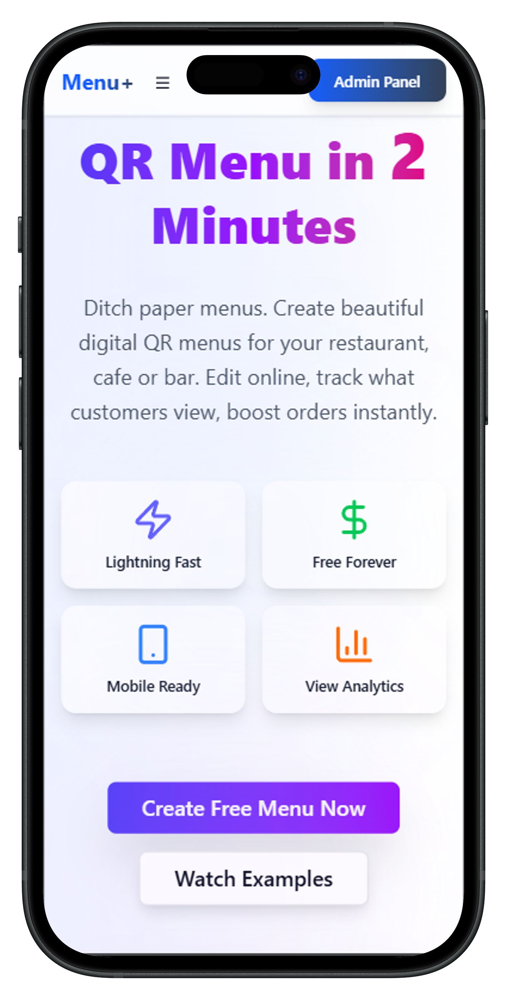  
Marketing landing page showing QR menu benefits, key features, and primary call-to-action buttons to create a free digital menu.

### 2. Sign Up & Email Verification  
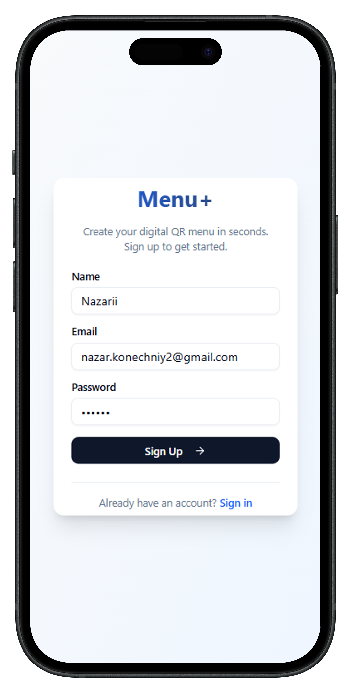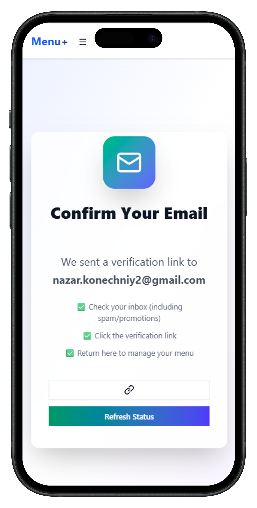  
Registration form and email confirmation screen.

### 3. Empty Venues & Venues List  
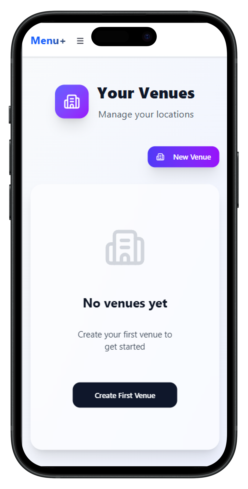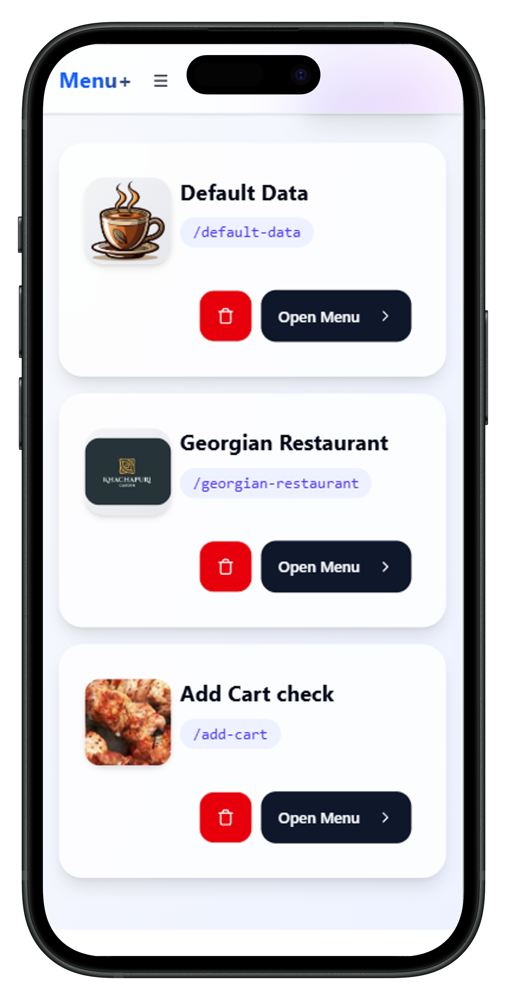  
Venues dashboard states: empty and with locations.

### 4. Edit Venue & Menu Overview  
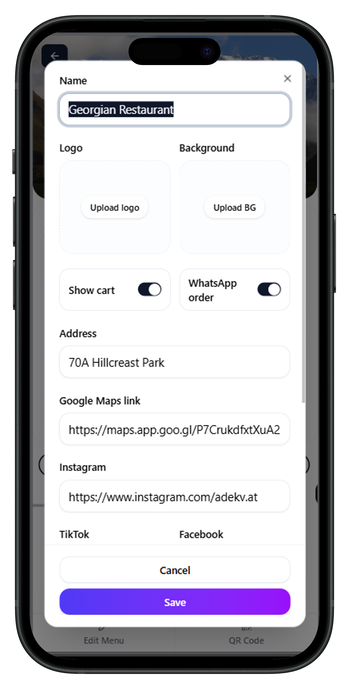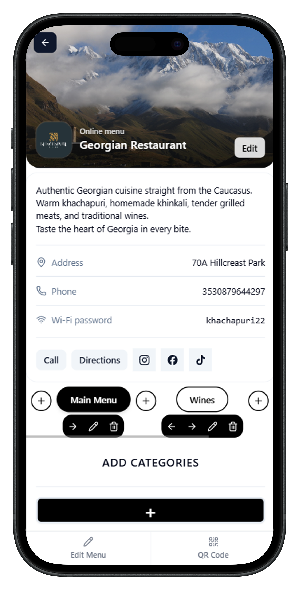  
Venue editing modal and public menu page for Georgian restaurant.

### 5. Categories Overview, Edit Category & Menu Item  
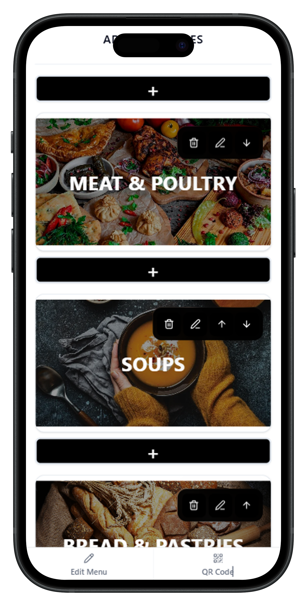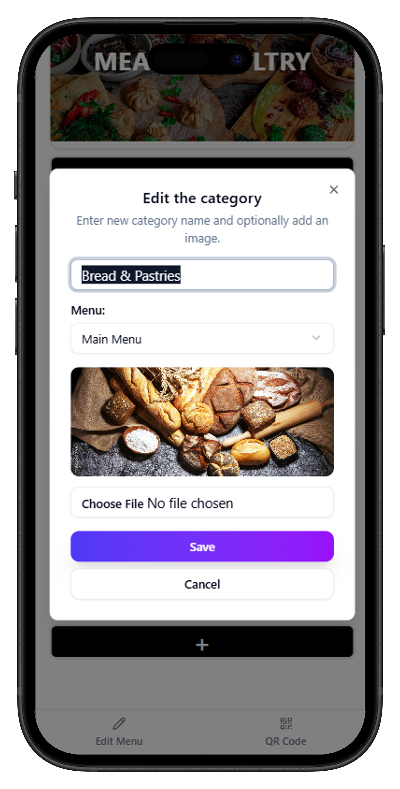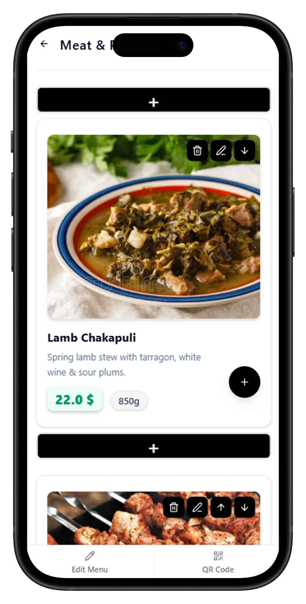  
Admin category management, editing, and individual dish editor.

### 6. QR Code Settings  
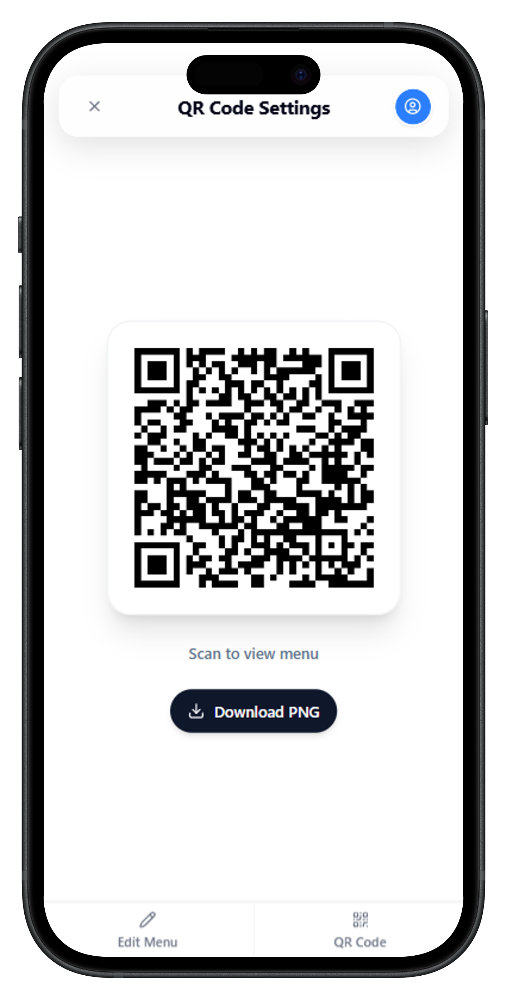  
QR code settings page that generates a scannable code linked to the menu and allows downloading it as a PNG file.

## Client Side Experience

### 7. Public Menu & Shopping Cart  
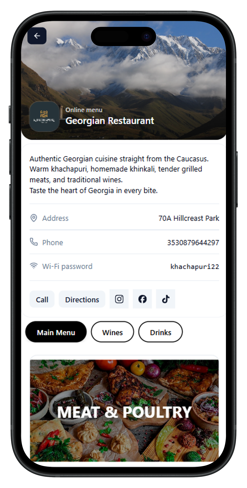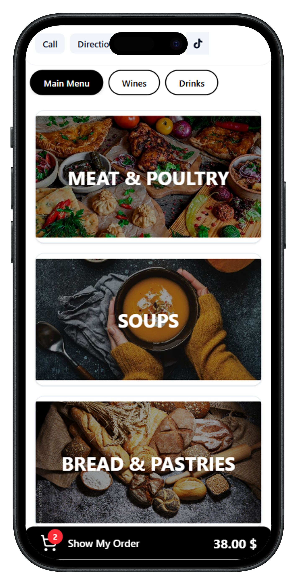  
Customer views full menu categories and adds items to cart with totals.

### 8. Order Summary & WhatsApp Integration  
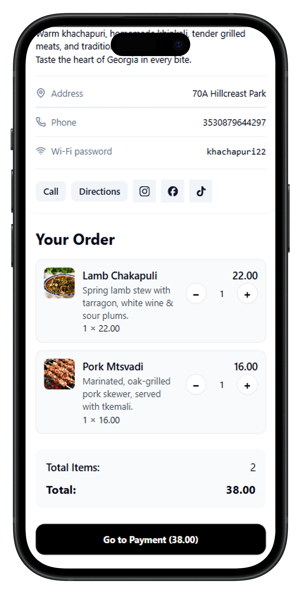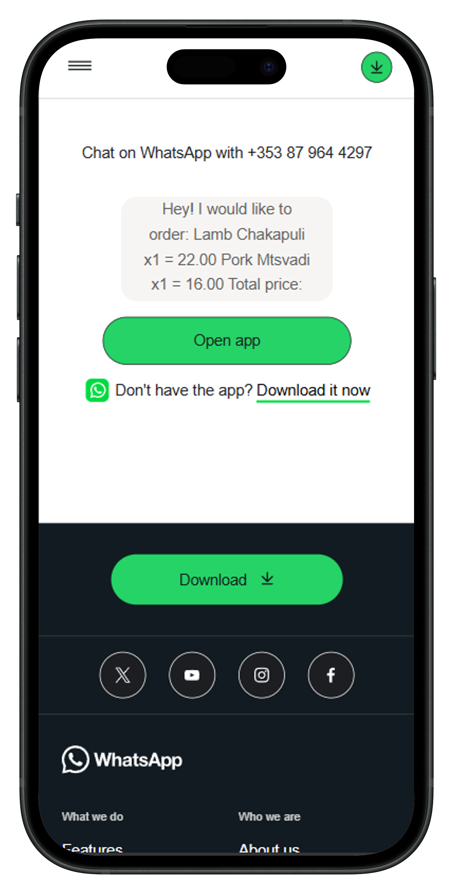  
Order confirmation screen and seamless WhatsApp order sharing/download.

**Flow:** Landing → Sign Up → Create Venue → Edit Details → Build Menu → Print QR → Done!

## 🚀 Installation

### Backend (FastAPI + Supabase)

1. **Create a Supabase account**  
   - Sign up at [Supabase](https://supabase.com) and create a new project.  
   - Go to **Project Settings → API** and copy:
     - `Project URL`  
     - `anon` (public) key  
   - Also copy the **PostgreSQL connection string** from **Project Settings → Database → Connection String**.

2. **Clone the repository**
   ```bash
   git clone https://github.com/NazariiKon/menu-plus.git
   cd menu-plus/server
   ```

3. **Create a virtual environment and install dependencies**
   ```bash
   python3 -m venv .venv
   # Windows:
   .venv\Scripts\activate
   # Linux/macOS:
   source .venv/bin/activate

   pip install -r requirements.txt
   ```

4. **Set up environment variables (`.env`)**  
   Create a file `server/.env` and fill it with the following:

   ```env
   # Database connection URL (PostgreSQL)
   DATABASE_URL=your_supabase_postgres_url

   # Supabase project URL (from Project Settings → API)
   SUPABASE_URL=your_supabase_project_url

   # Supabase anon/public key (from Project Settings → API)
   SUPABASE_ANON_KEY=your_supabase_anon_key
   ```

   Replace the placeholders with your own values from Supabase:
   - `DATABASE_URL` → from **Project Settings → Database → Connection String**.  
   - `SUPABASE_URL` → from **Project Settings → API → Project URL**.  
   - `SUPABASE_ANON_KEY` → from **Project Settings → API → anon public key**.

5. **Run the server**
   ```bash
   uvicorn src.main:app --reload
   ```

   - Server: `http://localhost:8000`  
   - API docs: `http://localhost:8000/docs`  
   - After first launch, call the migration endpoint to create tables:  
     `http://127.0.0.1:8000/database/migrate`

### Frontend (Next.js)

```bash
cd ../client
npm install
npm run dev
```

The client will be available at: `http://localhost:5173` (or another port if it’s taken).

## 🤝 Contributing

1. Fork the repo  
2. Create a feature branch  
3. Open a PR with a clear description  

Issues and feedback are welcome!